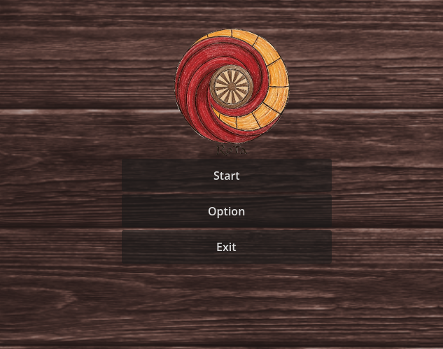

# RoTa - Tactical Board Game (Godot 4.6.2)
A 2D turn-based tactical board game developed in Godot 4.6.2 The project utilizes a dynamic grid architecture and an asynchronous AI engine. This repository is open-source and open for modification.

-[**Gameplay Link**](https://hanzzjl.itch.io/roundabouts).
 
-[**Gameplay Explanation**](https://www.youtube.com/watch?v=0yPl7OwOx7k).
## Architecture & Modification Points
If you intend to fork or contribute to this project, the core logic is divided into two primary controllers. Refer to these points for modification:
### 1. Engine Core (`game_controller.gd`)
Handles physics, matrix generation, and AI computation.
* **Universal Matrix Architecture (UMA):** Grid dimensions and offsets are calculated dynamically. Modify `N`, `cell_size`, and the `@export` tuning variables to implement custom board sizes beyond 4x4 or 6x6.
* **AI Logic (HDC Engine):** The AI utilizes Minimax with Alpha-Beta Pruning, executed on a background `Thread` to prevent UI deadlocks. 
  * To alter AI aggressiveness or positional awareness, modify the heuristic weights within `_evaluate_board()` and `_calculate_threat_line()`.
  * The bounded rationality (mistake probability) curve is located inside `_hdc_thinker_thread()`.
* **RTX Mechanics:** Trajectory constraints and collision detections for long-range attacks are processed in `_execute_rtx()`.
### 2. State & UI Management (`menu_controller.gd`)
Handles scene routing, configuration parsing, and system gates.
* **Persistent Settings:** Video, audio, and progression states are serialized to `settings.cfg`. Audio relies on Godot's logarithmic `linear_to_db` scaling.
* **Progression Gates:** Level restrictions (validating `aidepth` and `foursquaremap` against player `progress`) are explicitly defined in `_on_game_button_pressed()`.

---

## Pending Implementations (TODO)

The following modules represent the current technical debt and areas requiring development:

- [ ] **Netcode Implementation:** The "Online Match" feature is currently disabled. Requires peer-to-peer or dedicated server networking logic for remote multiplayer.
- [ ] **Local Multiplayer:** "Board Match" (Hotseat mode) is unbuilt. Requires bypassing the AI thread and assigning inputs to alternate players.
- [ ] **VFX Overhaul:** The RTX trajectory currently uses static sprite overlays (`Show Path` / `Eat Path`). Replace these with dynamic 2D shaders, raycast visualization, or particle systems.
- [ ] **Iterative Deepening:** The AI currently computes to a fixed maximum depth (Depth 6). Implement iterative deepening with a time limit to prevent excessive calculation times on lower-end hardware.
- [ ] **Audio State Machine:** Implement dynamic BGM transitions based on the board's tension state (e.g., when player or AI pieces fall below a certain threshold).
## Contribution Guidelines
Standard open-source pull request procedures apply. Ensure any modifications to the AI module strictly adhere to the established background-threading architecture. Do not instantiate visual or audio nodes directly within the `_hdc_thinker_thread` to avoid engine crashes.
